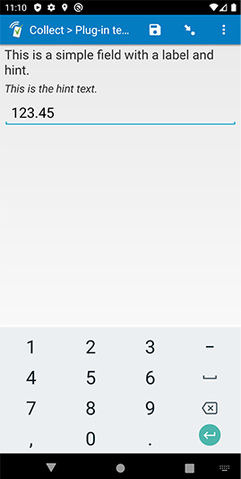

# Baseline decimal field

## Description

A baseline replacement for the default decimal field. Use this as a starting template when creating your own decimal field plug-in.

## Default SurveyCTO feature support

| Feature / Property | Support |
| --- | --- |
| Supported field type(s) | `decimal`|
| Default values | Yes |
| Constraint message | Uses default behavior |
| Required message | Uses default behavior |
| Read only | Yes *(shows the current value, if present)* |
| media:image | Yes |
| media:audio | Yes |
| media:video | Yes |
| `show-formatted` appearance | No |

**Note about the keyboard on iOS:**  
iOS has a less-consistent way of determining which on-screen keyboard to display than Android. If you plan on using this plug-in on iOS, you should test your form on the actual iOS device that you plan on using. If the wrong keyboard appears (for example, if there is no minus button available), you may supply an optional parameter to the plug-in to set the keyboard type manually. 

| Parameter key | Parameter value |
| --- | --- |
| `ios-inputmode` | Possible values: `none`, `text`, `decimal`, `numeric`, `tel`, `search`, `email`, `url`. [Click here for more information about the inputmode attibute.](https://css-tricks.com/everything-you-ever-wanted-to-know-about-inputmode)|

## How to use

**To use this plug-in as-is**, just download the [baseline-decimal.fieldplugin.zip](baseline-decimal.fieldplugin.zip) file from this repo, and attach it to your form.

To create your own field plug-in using this as a template, follow these steps:

1. Fork this repo
1. Make changes to the files in the `source` directory.

    * **Note:** be sure to update the `manifest.json` file as well.

1. Zip the updated contents of the `source` directory.
1. Rename the .zip file to *yourpluginname*.fieldplugin.zip (replace *yourpluginname* with the name you want to use for your plug-in).
1. You may then attach your new .fieldplugin.zip file to your form as normal.

## More resources

* **Test form**  
You can find a form definition in this repo here: [extras/test-form](extras/test-form). This form will help you compare your text field plug-in to the default text field. [Click here for instructions](/extras/test-form/README.md).

* **Developer documentation**  
More instructions for developing and using field plug-ins can be found here: [https://github.com/surveycto/Field-plug-in-resources](https://github.com/surveycto/Field-plug-in-resources)
